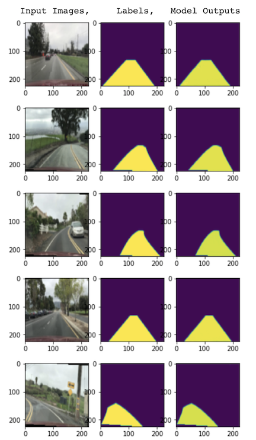

# Lane-Detection-using-UNet

## Description
Lane detection is a very important field in autonomous driving. Traditional lane detection aprroach of Hough Transform can only detects straight lines, and the performance is limited by light condition, shadow, other objects on the ground, etc. So I use the deep learning approach to accomplish such task.

## Dataset
* Images: https://www.dropbox.com/s/rrh8lrdclzlnxzv/full_CNN_train.p?dl=0 
* Labels: https://www.dropbox.com/s/ak850zqqfy6ily0/full_CNN_labels.p?dl=0 

Here is what the data looks like 
 

The dataset contains 12764 images and its corresponding labels and every data image is 80x160. The training image has 3 channels, but label images only contain 1 channel. 

## Pipeline
1. preprocess \
Since the input of the model has to be a square size, I resize the images to 224x224. Here is what it looks like

  

2. Split the dataset to training, validation, testing = 0.64 : 0.16 : 0.2

3. Model 
  - Model Structure
The model I use is the UNet. However, to match the model output size to the label image size, I add paddings of 1 to every conv2d layer. Here is the original structure of the model
    

      
    

  - Loss Function
  The loss function is Dice Loss function, which is defined as below 
    

      
    

  - Training Process
    

      
    

4. Test the model on testing dataset 
Here is visualization of how the model performed

  

5. Feed in video to the model 
Below is the video I took by myself and run through the model to see the performance. There are some post-processes I did to have a better performance. To denoise the frames, I cut the sky area. If it's cloudy day, the sky color is very similar to the ground, so the model will label the grey sky as lane as well. Secondly, I used the CV technique of erosion and dilation with 20x20 kernel size to get rid of the noise. 

  

